# someopark-football-agentic-simulator：一个带低秩球队身份与稳定化涌现控球的多智能体 LLM 足球模拟系统

**许凌霄（Lingxiao Xu）** — Someo Park — `admin@someopark.com`

> 本文所述系统由作者独立设计与实现；代码与比赛语料可复现全部图表与数字。本 Markdown 是 `paper.pdf`
> （由 `paper.tex` 构建）的可读伴随版。英文版为权威正式版本，中文仅供参考，如有出入以英文为准。
> 英文可读版见 `paper.md`。

---

## 摘要

我们提出 **someopark-football-agentic-simulator（SFAS）**，一个由二十二个 LLM 智能体踢完整场九十分钟
足球比赛的多智能体系统。其设计刻意极简：每一帧，系统向所有智能体广播同一份经过粗化的 **world map**；
每个智能体被并行且彼此隔离地查询，返回一个意图或一个持球动作；随后由唯一的确定性 **resolution
operator** 推进物理状态。智能体之间从不通信。球队身份不是提示词，而是一个**参数**——四十八支国家队
各为叠加在同一共享基座上的一个秩 16 LoRA，由球员属性与统计倾向蒸馏而成、部署时热插拔——赛前战术则由
一张 **knowledge graph** 锚定，给出少数几个控制设定点。本文是一项*系统*贡献：我们描述架构、按队适配
流水线与知识图谱锚定，并解释**系统为何稳定**。两个会拖垮朴素设计的涌现失败模式——控球*滚雪球*至垄断、
阵型*坍缩*到球上——是一般性的动力学现象，各由一条带清晰闭式阈值的控制律治愈：一条近期份额反馈律，当
增益超过 **g\* = 4(β−1)** 时消除一个 pitchfork 分岔；一条凸意图锚定混合，保证阵型离散度有正下界
**(1−λ)²S²**。在覆盖七个模拟 2026 世界杯对阵、共 75 场的语料上——从势均力敌到悬殊对碰——标准统计量落入独立
真实区间（传球成功率在全部 150 个队·场均在带内）；一次六场开环消融复现了所预言的双峰控球垄断；比赛
有竞争性而非照本宣科（五组一边倒对阵中，弱侧仍赢下 11% 的比赛——如巴拉圭在让出 69.5% 控球的情况下 1–0 击败法国）；
且优势方的控球对主客场对称（两组最悬殊对阵中，强侧主场 68.2% 对客场 68.6%）。

**关键词：** 多智能体系统；LLM 智能体；智能体模拟；涌现协调；低秩适配；知识图谱；去中心化控制；体育模拟。

---

## 1. 引言

LLM 正越来越多地被部署为**智能体**（感知→决策→行动）。多数工作研究单个智能体或少数*相互交谈*的智能体。
我们研究**众多** LLM 智能体共享同一个快速、对抗、物理受约束世界的情形，以及它提出的问题：**(i)** 无法
通信的智能体如何协调；**(ii)** 当集体行为是涌现的、自我强化的量时，是什么使其保持真实而非奔向退化态？

一场足球比赛是理想实例：封闭、二十二智能体、硬物理基底（球不可分且守恒）、丰富异质性、球队身份，以及
**可度量**的聚合不变量。与从奖励训练底层运动策略的强化学习足球环境不同，SFAS 把每名球员当作一个对球场
符号视图推理的**语言模型智能体**；其优点是可解释性与零样本战术控制，挑战在于 LLM 栈中没有任何东西保证
涌现的比赛真实。使其真实、并理解*为何*，正是本文内容。

**系统（图 1）。** 每一帧 SFAS 广播一份 **world map** `wₜ`——对全部 22 个位置（6×9 区域网格）、球、比分
与赛段的粗化共有描述——给每个智能体。无球时返回一个**意图**（目标区域 + 姿态）；持球时持球者返回一个
类别持球动作。每个智能体在**每一帧**上同时、隔离地行动——**并行查询、无消息通道、无出手顺序**。随后确定性 **resolution operator** Φ 推进状态
（移动、传球、抢断、射门、越位、进球）。球队身份是叠加在共享基座上的秩 16 LoRA；战术来自知识图谱；外层
校准门对照真实足球区间检查 11 项统计量。约 4000 帧产出一场完整比赛。

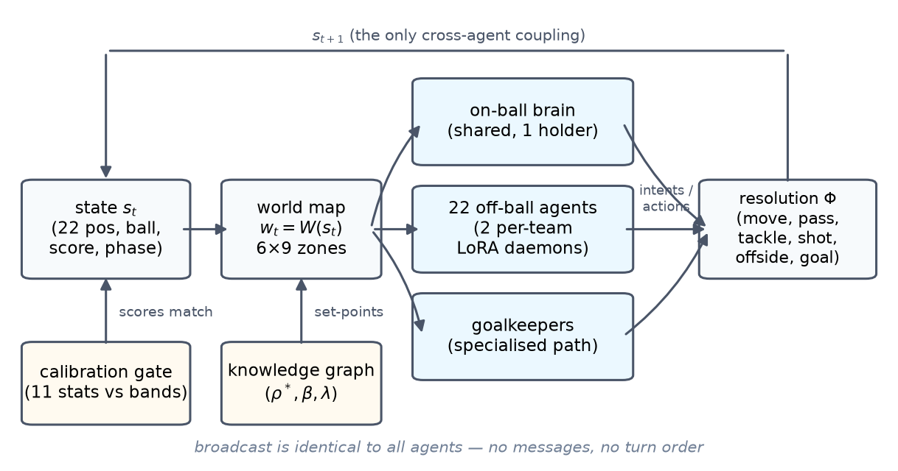
**图 1.** SFAS 智能体循环。共享世界地图广播给 22 个彼此隔离的智能体（一个共享持球“大脑”策略与两个按队
无球 LoRA 策略）；其意图仅由确定性算子 Φ 合并。知识图谱提供设定点；校准门为比赛打分。经由 Φ 的递归是
*唯一*的跨智能体耦合。

**为何朴素搭建会失败。**（1）控球**滚雪球**：早早赢球者整场保有（80–90%），因为持球自我强化。（2）逐字
执行时每个智能体的意图都是“去球那里”，阵型**坍缩**成一点。二者都是*动力学*而非实现问题，各由一条带清晰
阈值的控制律治愈。

**贡献。** 一个*系统*（SFAS：共享环境协调、LoRA 球队身份、KG 战术），形式化为 **stigmergic 马尔可夫博弈**
（命题 1）。*为何稳定*：控球在 β=1 处 pitchfork（定理 1），由反馈增益 **g\* = 4(β−1)** 消除（定理 2）并
带对阵相关设定点（推论），其逐对阵工作点由 CEM 在保证稳定的区域内*学习*而得（§6.2）；意图锚定保证
离散度 ≥ (1−λ)²S²（命题 2）。*验证*见 §7。

## 2. 相关工作

**LLM 智能体/社会：** Generative Agents（Park 等 2023）、Voyager（Wang 等 2023）、智能体综述（Wang 等
2023）；许多通过*通信*协调（CAMEL，Li 等 2023），单体经 ReAct 循环行动（Yao 等 2023）。SFAS 智能体从不
通信。**多智能体学习/团队博弈：** AlphaStar（Vinyals 等 2019）、OpenAI Five（Berner 等 2019）、捉迷藏
（Baker 等 2020）、RoboCup（Kitano 等 1997）、Google Research Football（Kurach 等 2020）——这些从奖励
*优化*策略；我们*规定* LLM 智能体并*分析*涌现不变量。**去中心化控制/stigmergy/平均场：** Dec-POMDP
（Bernstein 等 2002）、stigmergy（Theraulaz & Bonabeau 1999）、平均场博弈/MARL（Lasry & Lions 2007；
Yang 等 2018）。**方法：** LoRA（Hu 等 2021）、QLoRA（Dettmers 等 2023）、RAG/GraphRAG（Lewis 等 2020；
Edge 等 2024）、足球进球统计（Maher 1982；Dixon & Coles 1997；Skellam 1946）、强化过程（Pemantle
2007）、随机逼近（Benaïm 1999；Kushner & Yin 2003）、pitchfork（Strogatz 1994）、交叉熵法
（Rubinstein & Kroese 2004）。

## 3. 系统架构

SFAS 是一个以离散**帧**推进的**实时**模拟，正如游戏引擎逐帧渲染一场比赛：一帧是对连续演化比赛的瞬时
采样，而非某名球员的“回合”。全部 22 个智能体在**每一帧**上同时、独立地感知并行动——无出手顺序、无轮流。
一帧把物理时间推进一个小的固定增量；约 4000 帧的比赛由这些固定的模拟时间步构成——正如游戏引擎逐帧推进其世界——而非回合。下标 `t`
即按此意义为帧编号。

**状态/世界地图/解算算子。** 状态 `sₜ = ({xᵢ,rᵢ}, bₜ, cₜ, phₜ)`。智能体从不看到 `sₜ`；它们看到共享
**world map** `wₜ = W(sₜ)`（6×9 区域网格 + 角色 + 持球标志 + 比分 + 赛段），原样广播给所有智能体。确定性
**resolution operator** `Φ` 把每名球员朝其意图与阵型锚点的混合方向移动一个有界步长，以技能加权竞争解算
一个持球动作，强制单一持球者守恒，并裁决抢断/传球/射门/越位/进球。`Φ` 承载环境随机性（技能竞争）、也是
22 个动作唯一相互作用之处；智能体策略本身亦随机。

**三种策略与部署。**（a）一个共享**持球“大脑”**决定唯一持球者的动作（较大模型，作为延迟优化每隔几帧
重新查询——算力节流，而非轮流出手；持球者仍在每一帧行动，其上次动作在查询间持续）。（b）两个
**无球**策略（每队一个）决定其余球员意图——即 §4 的球队 LoRA，作为两个独立守护进程部署。（c）门将走专用
路径。由于智能体不通信（命题 1），全部 22 次查询并行、两个守护进程并发——这正是让 4000 帧比赛在本地可行
的关键。

**模型无关的 backbone。** 策略经由一个狭窄统一接口触达模型（结构化提示进、schema 约束决策出），故架构
不绑定任何模型族。我们将持球大脑以 **Nemotron-3 Super（120B）** 运行、并在第二台机器上以
**Qwen3.5-35B-A3B** 运行，球员以 **Gemma-4-E2B** 适配器运行；§6 的涌现性质在任一大脑下定性不变——它们是
控制律的性质、非 backbone 的性质。任何能发出决策 schema 的指令微调模型皆可即插即用：可比 backbone 在大脑
层包括 **Llama-4-Maverick、Qwen3.5-72B、Mistral-Large-2、DeepSeek-V3.2、MiniMax-M1**，球员层（3–10B）
包括 **Gemma-4-E4B、Qwen3.5-9B、GLM-4-9B（智谱）、InternLM3-8B、MiMo-7B（小米）、Hunyuan-7B（腾讯）**。由于身份在秩 16 适配器、战术在 KG（非基座
权重），更换 backbone 既不改球队库也不改控制律。

## 4. 用按队 LoRA 编码球队身份

**球队身份是参数，而非提示词**（图 2）。我们*训练*一个小适配器，把基座策略朝球队特征性选择移动。

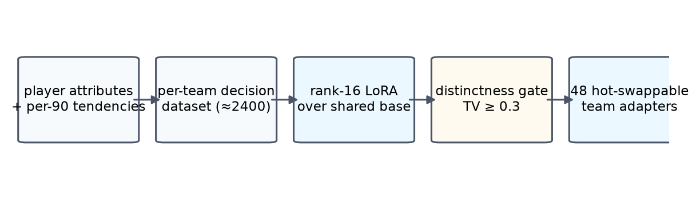
**图 2.** 球员属性 + 每 90 分钟倾向 → 按队决策数据集（约 2400 条）→ 共享基座上的秩 16 LoRA → 按队策略，
须通过可区分性门方可采纳。48 队 = 48 个可热插拔适配器。

- **决策数据集。** 每队约 2400 条（世界地图情境，决策）对，由球员属性（射术、传球、抢断、速度、角色）+
  每 90 分钟倾向生成。
- **低秩适配。** 球队 τ 为 `W₀ + B_τ A_τ`，秩 r = 16 ≪ d，冻结基座上监督微调。*成本*：各几十 MB → 48 队
  与一个基座并存、部署时热插拔。*简约*：身份是对共享足球先验的扰动 → 正则化且低维。
- **可区分性门。** 仅当其决策分布与其他每队相差 ≥ 0.3 总变差时采纳（§8.1），保证 48 种真正不同的风格。

## 5. 知识图谱战术锚定

按队 LoRA 编码*球员是谁*；它不编码*球队作为整体打算如何踢*，也不让设计者编辑战术。SFAS 用一张**战术知识
图谱**补足——而且，关键在于，KG 是使 LoRA 与无消息框架**协同**得更好的那个组件（图 3）。

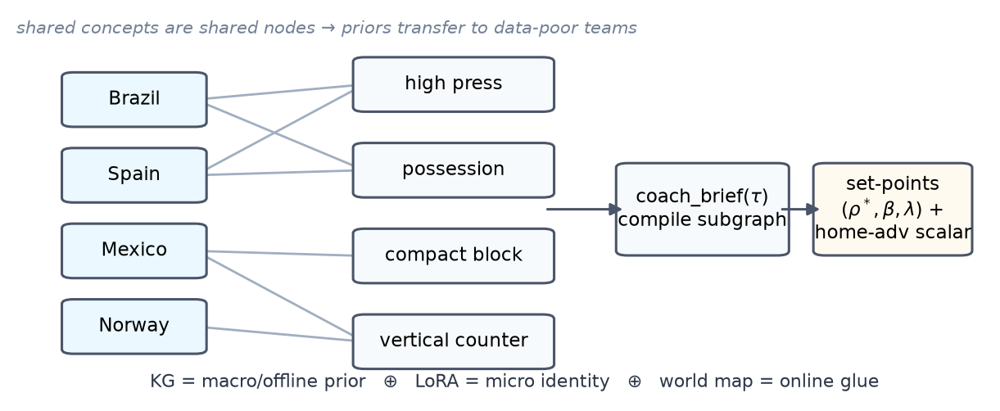
**图 3.**（1）一张关系图把 48 队连到共享战术*概念*（高逼抢、控球、紧凑防守、纵向反击）；共享风格是共享
节点，故知识**迁移**、数据稀缺球队继承先验。`coach_brief(τ)` 把子图编译成设定点 `(ρ̂, β, λ)`（示意图中记作 ρ* 的即此控球目标 ρ̂，见 §6.2，区别于
反馈死区 ρ*）+ 主场优势
标量。（2）这些设定点正是控制律所执行、LoRA 微观决策在其中运作、并对齐无消息智能体的对象。**KG = 宏观/
离线先验 ⊕ LoRA = 微观身份 ⊕ world map = 在线黏合。**

**是什么/如何运作。** 覆盖全部 48 队的关系本体：节点为球队、战术概念、角色、组合；被若干球队共享的概念
是*一个*节点，故图谱高度互联。一道轻量确定性编译构建它；一道可选 LLM 增强用叙事文本充实并建索引以供混合
检索（RAG/GraphRAG）。比赛时 `coach_brief(τ)` 检索 τ 的子图并编译成系统消费的控制设定点（控球目标 → §6.2 的**对阵**锚点，
由学习所得标定 policy 从**双方**风格向量编译；逼抢 → β；紧凑度 → λ）。该读取离线自包含——比赛循环内无需实时数据库。

**它如何提升系统。**（i）*一致性*——每场注入同样的战术事实。（ii）*迁移*——共享风格是共享节点，数据稀缺
球队从邻居继承先验。（iii）*可解释、可编辑接口*——编辑一个节点，改动传播进设定点。（iv）*关注点分离*——
KG = 球队级意图，LoRA = 球员级倾向。

**与 LoRA 和智能体框架的协同。**
- **图谱 ⊕ LoRA：宏观意图遇上微观身份。** LoRA 移动球员的*微观*决策分布；KG 设定球队所处的*宏观*范围。
  控球设定点配“直接打法”前锋的适配器，产出以早射门收尾的耐心组织——任何单一提示都难以可靠诱出。KG 还
  *弥补 LoRA 的数据局限*：薄弱适配器经共享概念边仍得到合理战术先验。KG 选目标 ρ̂ 与 β、λ 设定点；LoRA 选每帧动作分布；
  校准门检查联合结果。
- **图谱 ⊕ 智能体框架：球队级相关化装置。** 智能体无消息（命题 1）：一帧内只经世界地图协调，后者承载*位置*
  而非*策略*共有知识——不存在让 11 名队友约定整体高逼抢的赛中通道。KG 恰好填补：一个**离线、球队级的相关
  化装置**（赛前指令经共享设定点内化），而世界地图是**在线、逐帧级**装置。不同时间尺度、互补。图谱设定
  *设定点*，世界地图承载*状态*，LoRA 提供*策略*，控制律保证稳定。

## 6. 系统为何稳定

（证明见附录 A；此处讲机制 + 图。）

### 6.1 无通信的协调

**stigmergic 马尔可夫博弈**：每个智能体观测同一 `wₜ = W(sₜ)`，无其他输入（无通信、一帧内不窥探他人），
状态由 `sₜ₊₁ = Φ(sₜ, **a**ₜ)` 推进。

> **命题 1（分解）。** `P(**a**ₜ | sₜ) = ∏ᵢ πᵢ(aᵢ | W(sₜ))`。全部跨智能体依赖由 Φ 与递归产生；决策步内
> 不产生。共享地图是相关化装置。

这许可了 §3 的并行、无消息部署，并告诉我们协调失败位于乘积策略与 Φ 随时间的相互作用中。

### 6.2 控球是双稳态的——而一条反馈律能修复它

主队近期份额由 EMA `ρₜ₊₁ = (1−α)ρₜ + α bₜ₊₁`（式 1）追踪，其中 bₜ₊₁ ∈ {0,1} 指示主队是否赢得下一次
持球争夺。强化换手 hazard `h_H = h₀e^{−β(2ρ−1)}`、
`h_A = h₀e^{+β(2ρ−1)}` 给出下一持球者概率 `q(ρ) = σ(4β(ρ−½))`。式 (1) 是常增益随机逼近。

> **引理 1（平均场约化）。** 式 (1) 是 Robbins–Monro 递归，其平均场为梯度流 `ρ̇ = m(ρ) = q(ρ) − ρ`。
> 由 ODE 方法（Benaïm 1999）轨迹收敛到 m 的稳定不动点、几乎必然回避不稳定者，并在稳定点附近以 O(√α) 波动。

> **定理 1（双稳态）。** ρ = ½ 稳定当且仅当 β < 1。β = 1 处发生*超临界 pitchfork*：β > 1 时 ½ 不稳定，
> 出现两个稳定垄断不动点 ρ±，当 β → ∞ 时 → {0,1}。故对任意 β > 1，未受控模拟器几乎必然把控球驱向近乎
> 垄断（图 4）。

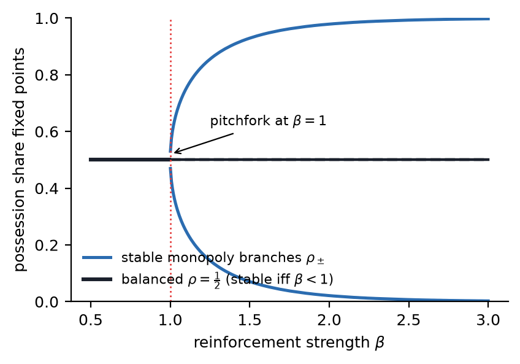
**图 4.** 开环控球平均场在 β = 1 处发生超临界 pitchfork：50% 均衡失稳，涌现两条控球垄断分支（定理 1）。

治愈：一旦某队近期份额越过死区 ρ*，按 `(1 + g(ρ−ρ*)₊)` 抬高*它*的换手 hazard，增益 g。

> **定理 2（稳定化、临界增益）。** β > 1、ρ* = ½ 时：均衡态稳定当且仅当 **g > g\* = 4(β−1)**。此时它是
> *唯一*稳定均衡，垄断态被摧毁，控球集中在目标的 O(√α) 邻域。

把对抗占优的增益取得大于强化超额的 4 倍，注定的垄断便成受控比赛。系统用 **g = 22、α = 0.02（约 50 帧
窗口）、ρ* = 0.55**；g = 22 对每个直到 β = 6.5 的强化强度都越过 g\*。图 5 以 Monte-Carlo 确认：双峰
（g = 0）→ 单峰（g = 22）。

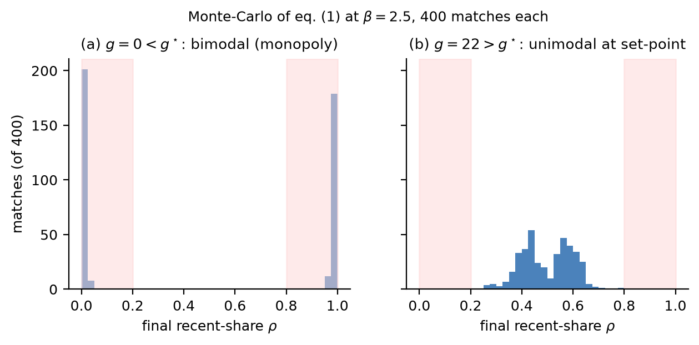
**图 5.** β = 2.5 下对式 (1) 的 Monte-Carlo（各 400 场）。(a) g = 0 < g\*：双峰——控球垄断。(b)
g = 22 > g\*：单峰、集中于设定点，恰如定理 2 预言。

> **推论（主场优势设定点）。** 一个小主场优势把唯一不动点移至 `ρ† = ½ + (η_H+η_A)/(2(g−g\*)) + O(η²)`
> ——一个标量连续单调地移动校准后的控球目标。*图谱设定点，控制律执行之。*

**对阵相关标定——由学习给出，而非手工设定。** 推论中的设定点不是全局常数：它按**对阵**、由双方的真实
风格向量（48 队实测控球/传球成功率/实力统计库）编译而得。编译目标为
`ρ̂(h,a) = clip(½ + κ·[w_p·Δ控球 + w_c·Δ传球 + w_z·Δz] + η_主场, ½ ± b)`，带宽 b = 0.065——经推论的机制
实现为闭环不动点 ρ†——西班牙–奥地利与巴西–日本得到*不同*的标定，而任意两组对阵的目标差被限制在 13 个
百分点内。执行刻意柔和——*被引导的涌现*：目标只设一个低增益导演（k_p = 0.4，教练式轻推而非强拉）与一条
弱化的物理倾斜；三条风格通道则作为**行为**修饰注入——逼抢以 (1 + 0.6·(press−½)) 缩放对手的丢球 hazard、
并以 (1 − 0.30·(press−½)) 收紧盯人距离进入上下文传球完成率模型；节奏缩放持球方出球 hazard；直接度重排
传球目标评分——控球差由此*从行为博弈中涌现*，而非被强加。分工在数字上一目了然：最悬殊的对阵里，编译
目标在 clip 处饱和（56.5%），而涌现落位是 68.2–68.6%（§7）——目标最多贡献落位的 6.5 个百分点，其余约
12 个百分点由三条行为通道经对抗产生。八个标定参数 θ = (κ, w_p, w_c, w_z, 倾斜尺度, 三个风格增益)由
交叉熵法（CEM；Rubinstein & Kroese 2004）策略搜索在引擎 rollout 上**学习**而得：逐对阵损失 = |涌现份额 −
真实世界锚点| + 垄断惩罚 + 传球成功率出带惩罚。训练用三组实力跨度不同的对阵——*西班牙–奥地利*、
*巴西–日本*与语料之外的*卡塔尔–西班牙*——因此**七组评估对阵中有五组是 held-out**，包括场地对称性检验
所依赖的两组重悬殊对阵（*阿根廷–佛得角*、*巴拉圭–法国*）；损失四轮内 0.232 → 0.150（种群 8），学得
κ = 1.18、w_p = 0.44、w_c = 0.11、w_z = 0.01、逼抢/直接度/节奏增益 0.69/0.38/0.50（policy 存档于
`calib_policy.json`，训练器 `calibrate_policy.py`）。学出的目标依赖风格差而几乎不用原始实力差
（w_z ≈ 0）是符合预期的——控球与传球风格本就编码了实力——因此 §7 的实力差伸缩经由风格通道传导，而非
单独的实力项。§7 的两条可观察结论——优势方落位随实力差平滑变化、及其主客对称（主场 68.2% 对客场
68.6%，且都在 held-out 对阵上）——来自这一对阵相关、学习所得的整套 policy：目标**加**行为增益，而非
目标单独。

**注记（死区、工作点、实测 β）。** 定理 2 分析 ρ\* = ½，此时阈值恰为 g\* = 4(β−1)。部署用 ρ\* = 0.55：
½ 附近反馈不激活（故 ½ 局部不稳定，开环斜率 β−1 > 0），份额漂到死区边缘才被反馈拉住——这正是为何即便
任何主场优势之前，各组对阵的落位就贴着各自的编译目标——巴西–日本（目标 55%）落位边缘外侧 59%、
科特迪瓦–挪威（53%）落位 52%、墨西哥–厄瓜多尔（50%）落位 54%。**β 由六场开环（g = 0）消融实测**
（4,325 持球拍；W = 100 下 36 个窗口转移对）。超临界的主证据是行为性的（图 6）：六场中五场漂向极端——69% 的份额
窗口落在 ρ ≤ 0.35 或 ρ ≥ 0.65、仅 5% 保持中央，领先模态份额 ρ⁺ = 0.68——对比闭环在均势对阵上的单峰
（极端 11%、中央 33%）。按定理 1 的反向读法，此类漂移仅在 β > 1 时发生。点估计符号一致：份额转移映射在 ρ\* = ½ 处的局部斜率（直接估计器）
给出 β̂ ≈ 1.6–2.3，模态不动点关系 β = logit(ρ⁺)/(4(ρ⁺−½)) 给出 β̂ ≈ 1.05；*全局* logistic 拟合为
0.77–0.91——在此构造下必然低估，因为它把漂移被截断的饱和分支也并入拟合（与 AR(1) 斜率作为下界
≈ 0.7–0.8 同一机制）。一项合成恢复实验（同一估计管线跑已知 β 的 eq.(1) 轨迹；存档于
`beta_estimator_calibration.txt`）证实了这一判读：AR(1) 即使在真值 β = 2 时也只返回 0.93–1.00（<1）；
在引擎式分支饱和下，模态估计器无论真值 β ∈ [1.5, 2] 都压缩到 ≈ 1.05——与我们实测的 1.047 吻合——
而亚临界对照（β = 0.8）只产生 29–38% 极端窗口且局部斜率 < 1，对比超临界的 83–100% 与 ≈ 1.9
（实测：69% 与 1.6–2.3）。数据因此与真·超临界系统一致、与亚临界系统不一致。
结论对这一散布不敏感：即便取最大估计，g\* = 4(β̂−1) ≈ 5.1，而部署 g = 22 对任何
β ≤ 6.5 都超过 g\*——反馈远在临界增益之上，这正是闭环控球稳落区间的原因（§7）。

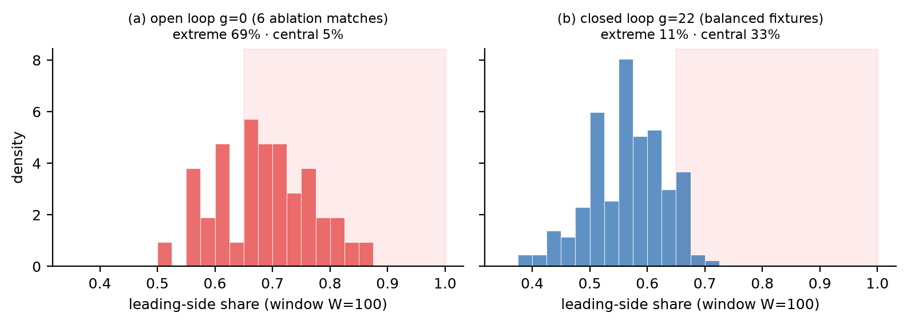
**图 6.** 领先方份额分布（W = 100 持球帧窗口）。(a) 开环（g = 0，六场消融）：质量漂向极端——69% 的
窗口落在 ρ ≤ 0.35 或 ρ ≥ 0.65、仅 5% 中央——定理 1 对 β > 1 预言的双峰签名。(b) 闭环（g = 22，
两组均势对阵）：单峰，极端 11% / 中央 33%；垄断区（阴影）保持为空。

### 6.3 阵型不会坍缩

无球移动混合目标与锚点：`xᵢᵗ⁺¹ = (1−η)xᵢᵗ + η[(1−λ)φᵢ + λzᵢᵗ]`（式 2）。

> **命题 2（不坍缩）。** 若全员瞄准共同点（最坏情形），并带跨球员方差为 σ_z² 的特异异质性，稳态离散度
> `S∞² = (1−λ)²S² + λ²σ_z² ≥ (1−λ)²S²`。对任意 λ < 1 阵型不会坍缩；坍缩需 λ = 1 且 σ_z = 0（零测度）。

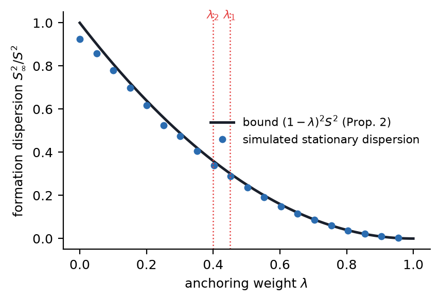
**图 7.** 意图锚定对任意 λ < 1 保证离散度 ≥ (1−λ)²S²（命题 2）。SFAS 两阶段锚定（λ₁ = 0.45、λ₂ = 0.40）
即便全员追球也保留约 11% 阵型展开。

### 6.4 校准作为外环

控制律被调校得使聚合统计量落入真实区间（表 1）。两处耦合：控球率*与*控球段数都由定理 2 支配；射门统计
只因命题 2 使阵型不坍缩才有意义。

**表 1. 真实区间与支配律。**

| 统计量 | 区间 | 支配律 |
|---|---|---|
| 控球率 | 30–70% | 定理 2、推论 |
| 射门 | 5–20 | 射门门 + 离散度 |
| 射正率 | 25–50% | 射术竞争 |
| 扑救率 | 60–80% | 门将竞争 |
| 传球成功率 | 50–90% | 上下文断球（逐脚实测） |
| 越位 | 0–5 | 防线几何 |
| 控球段数 | 60–220 | 定理 2（换手率） |
| 进球 | 0–7 | 终结竞争（Skellam 差） |
| xG | 与进球一致 | 射门质量模型 |
| 回收球时间（秒） | 5–60 | 换手 hazard |

## 7. 实验

**设置。** 适配器以秩 16 在共享基座上、由按队数据集（各约 2400 条）为 48 支世界杯决赛圈球队蒸馏。逐对阵控球锚点由 §6.2 的学习所得标定 policy 从双方真实风格向量编译（CEM 拟合，存档于
`calib_policy.json`），并柔和执行（k_p = 0.4 导演 + 弱化倾斜 + 风格→行为增益）。每场约 4000 帧；一个共享持球大脑（以 **Nemotron-3 Super** 运行、并在第二
台机器以 **Qwen3.5-35B-A3B** 运行，行为一致）+ 两个 **Gemma-4-E2B** 无球守护进程；backbone 可互换。每场
归档（轨迹、
11 项统计行、配置、回放）；全部图表可复现。语料为**七组对阵共 75 场**、覆盖实力谱系：*巴西–日本*、*科特迪瓦–挪威*、
*墨西哥–厄瓜多尔*、*西班牙–奥地利*、*比利时–塞内加尔*、*阿根廷–佛得角*（各十场）与十五场
*巴拉圭–法国*系列；新对阵以同一模式增量纳入。

**统计真实性（图 8）。** 全部 75 场的聚合统计量落入区间：传球成功率在**全部 150 个队·场**均在带内
（64.6–87.4%，均值 76.3%）；优势方控球随实力差伸缩（均势至中间梯队的逐对阵均值 52–60%，最悬殊对碰达 68–69%），且每场
都留在 30–70% 内；控球段数、越位、回收球贴合各自区间；进球与 xG 一致（149 球对 207 xG；每队·场
goals−xG 为 −0.39——终结带噪且略保守）。两处可理解的逐场例外：（1）射门数在最高节奏比赛中超出保守的
5–20 区间（开放比赛产生 25+ 次射门，忠实于真实足球），在悬殊对阵中防守大巴一侧则低于它；（2）扑救率
作为一场内对少数射正之比、本就高方差，在少射门比赛中达到 100%（小分母效应，如真实的零封）。二者都是
小计数效应、非动力学；区间给的是*典型*值，而均值遵从之。

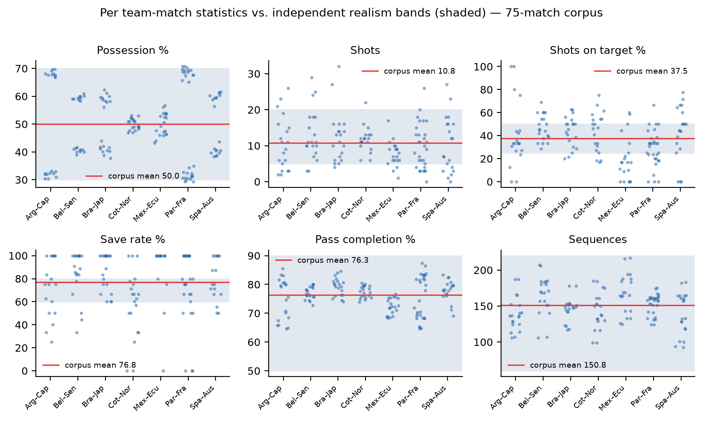
**图 8.** 七对阵、75 场语料中六项有代表性的统计量（共十一项），按队，对照真实区间。均值落在每个区间内；
射门区间的越界来自最高节奏的比赛与最深的防守大巴。

**控球的实战表现（图 9–10）。** 单场内（图 9——巴拉圭–法国 1–0 爆冷场），优势方累计控球收敛到 69.5%，
EMA 在其附近波动，且在开局瞬态之后**不再进入**开环动力学本会漂向的 >80% 垄断区——定理 2 在最难情形
（悬殊对碰）下的实证面貌。全部 75 场中（图 10），优势方落位随实力差平滑变化——均势对阵 52–60%、最悬殊
对碰 65–70%——且从不成为垄断。两项检验闭合论证：**主客对称**（强侧在主场落位 68.2%（阿根廷）、在客场
落位 68.6%（法国）——仅差 0.5 点，落位由实力决定而非主客场）与**控球 ≠ 结果**（法国拿下 69.5% 控球
仍输掉图 9 那场）。

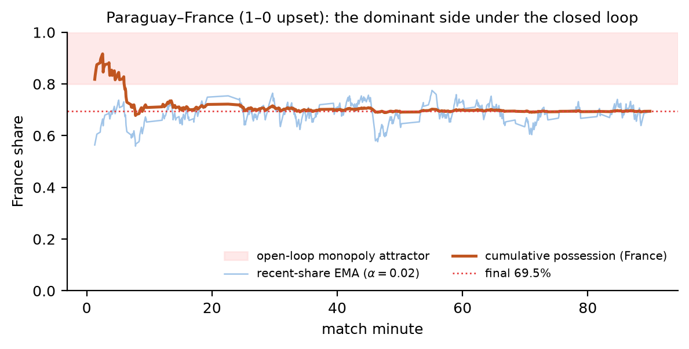
**图 9.** 单场内的优势方（巴拉圭–法国，1–0 爆冷）。法国的累计控球（深色）收敛到 69.5%；EMA（浅色）以
所预言的 O(√α) 幅度波动，开局瞬态之后不再进入开环垄断吸引区（阴影）——而法国仍然输球。

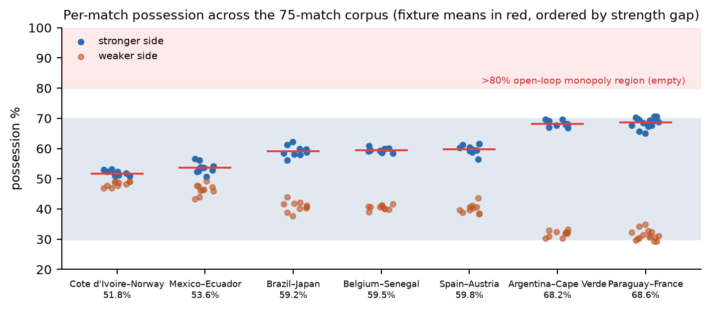
**图 10.** 全部七组对阵的各场控球。优势方的落位随实力差平滑变化；两队均不接近垄断区；每场都留在 30–70% 区间内。

**竞争均衡与终结（图 11–12）。** 战绩追随实力却不照本宣科（图 11）：两组均势对阵五五开（巴西–日本
3-4-3、墨西哥–厄瓜多尔 2-6-2），其余五组为**一边倒**——一方以六场或以上赢下系列（西班牙 7-2-1、比利时
与阿根廷 8-1-1、科特迪瓦 6-3-1、法国*客场* 8-5-2）。但在这五组一边倒对阵中，弱侧（系列负方）仍赢下
55 场中的 6 场（11%），这正是稳定化律带来的真实爆冷率：被压制一方留在比赛里而不是被碾过。总计主队 36-22-17、149 球、无大胜失真。射门量随territorial控制而变，已实现进球散布在
xG 对角线两侧（图 12），转化率略低于 1——带噪、温和保守的终结。代表性比赛见表 2。

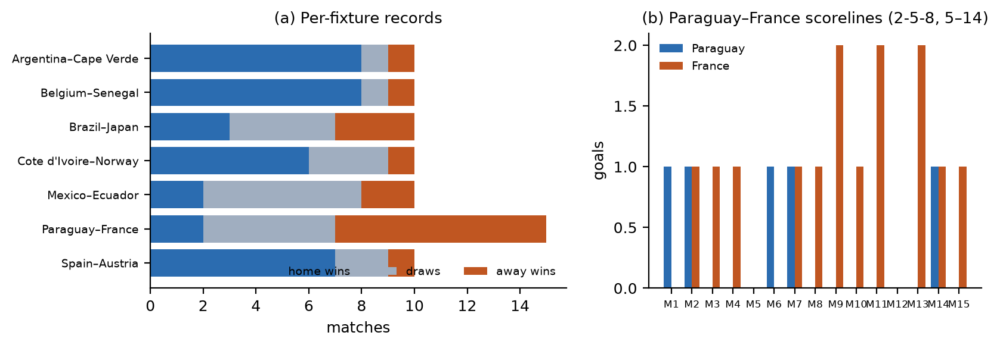
**图 11.**（a）各对阵战绩（主胜/平/客胜）。（b）巴拉圭–法国各场比分（2-5-8，总进球 5–14）：法国压制，但巴拉圭赢下两场、逼平五场。

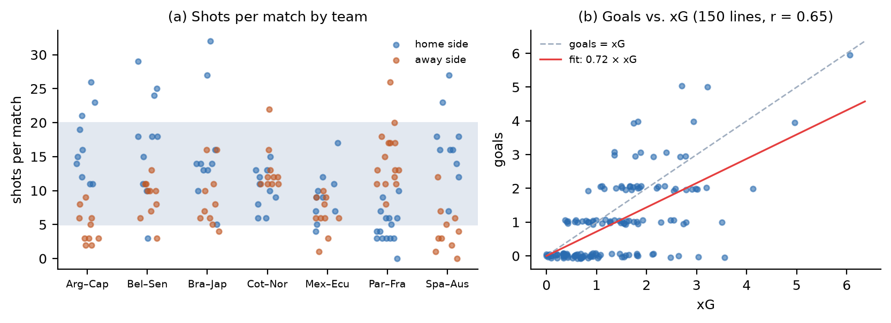
**图 12.**（a）各对阵各队每场射门数。（b）全部 150 个队·场的已实现进球对 xG；点散布在对角线两侧，转化率略低于 1。

**表 2. 一场代表性巴拉圭–法国比赛（0–1）：重度风格错配，全部在带内。**

| 统计量 | 巴拉圭 | 法国 |
|---|---|---|
| 控球率 | 32.4% | 67.6% |
| 射门 | 3 | 13 |
| 射正率 | 33.3% | 38.5% |
| 扑救率 | 80.0% | 100.0% |
| 传球成功率 | 68.2% | 87.4% |
| 传球数 | 192 | 412 |
| 越位 | 1 | 6 |
| 控球段数 | 141 | 142 |
| 进球 | 0 | 1 |
| xG | 0.34 | 1.64 |
| 平均回收球时间（秒） | 25.9 | 12.3 |

**风格可辨识性。** 在 150 个与比赛完全一致的无球探针上实测（部署同款 prompt 与 schema；每队每探针
采样 K = 20 个决策；对半分自身 TV 噪声地板 0.42）：全部 1,128 个成对决策 TV 均超过 0.3 门——最小
0.45（波黑–南非，两支低位防反队）、中位 0.78——98% 的对高出噪声地板 0.10 以上，每队最近邻距离中位
0.59（图 13）。故由命题 3（§8.1）各队可由常数次探针行为上区分——适配器编码了不同风格，而非塌回
共享基座（存档于 `style_distance_matrix.json`）。

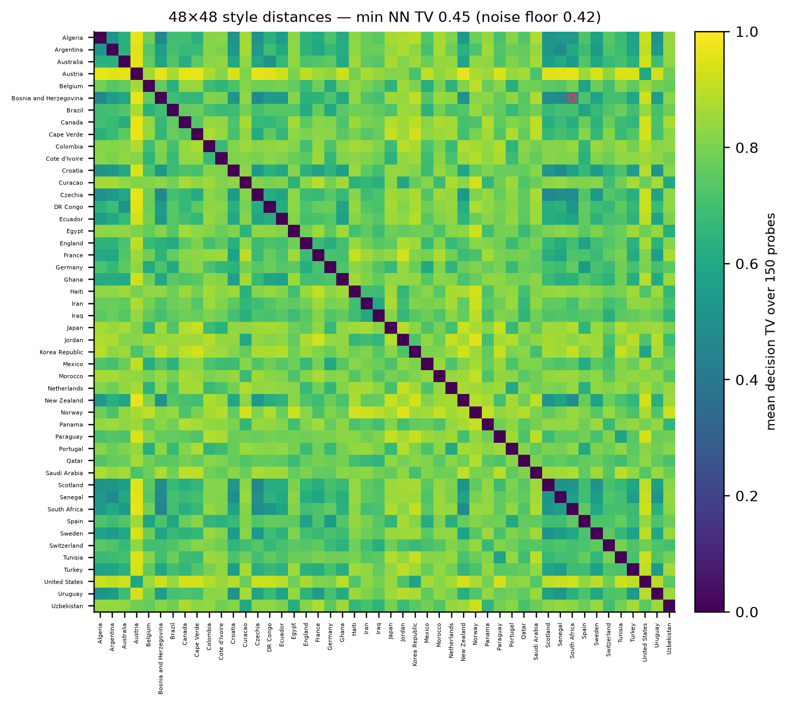
**图 13.** 在 150 个与比赛完全一致的无球探针上实测的 48×48 成对决策 TV 矩阵（对角线 = 0）。全部
1,128 对均超过 0.3 门；标记格为最接近的一对（波黑–南非，两支低位防反队，TV = 0.45，噪声地板 0.42）。

**Backbone 鲁棒性。** 该
设计与 backbone 无关（§3），故我们在系列上做两组扫描、固定其余一切。*大脑扫描*：大脑在 [Qwen3.5-35B-A3B、
Nemotron-3 Super、Llama-4-Maverick、MiniMax-M1] 间切换（球员固定）。*球员扫描*：球队适配器重新蒸馏到
[Gemma-4-E4B、Qwen3.5-9B、GLM-4-9B、InternLM3-8B、MiMo-7B、Hunyuan-7B]——取自六家机构（Google、阿里、
智谱、上海AI实验室、小米、腾讯）的 3–10B 区段，大脑固定。**(i) 不变性**（图 R1）：跨 backbone 控球落在
59.2±2.0%、无垄断，统计落区间，每项指标的跨模型离散度（控球 0.9 个百分点）< 场间标准差，各替代大脑对部署大脑的逐项均值差全部横跨零（图 R3），Kruskal–Wallis 不拒绝相同（每项指标 p ≥ 0.6）。
**(ii) 扰动排序**（图 R2a）：换 backbone 决策分布只移 0.06±0.02 TV——低于换队 0.34 与 0.3 门——故换
模型扰动 < 换球队（§8.1）。**(iii) 成本而非行为**（图 R2b）：backbone 决定合法率 96.8–99.8% 与延迟
60–560 ms，但不改涌现比赛；所有 backbone 都达到稳定比赛所需合法率。模型选择是成本/延迟问题，非正确性问题。

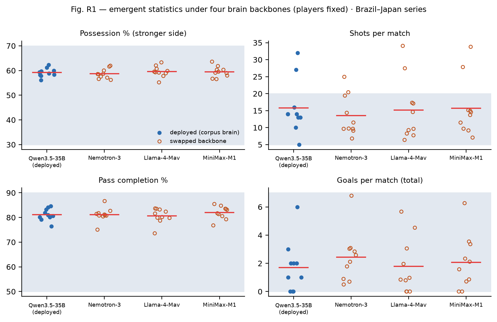
**图 R1.** 四个大脑 backbone 下的涌现统计（球员固定）；红线为各臂均值，阴影为真实区间。四臂在每个
面板上统计不可区分：控球均值横跨 58.7–59.6%（离散 0.9 个百分点，对比场间 SD 1.7）、射门 13.5–15.8
（2.3 对 7.5）、传球成功率 80.7–82.0%（1.4 对 2.3）、总进球 1.7–2.4（0.7 对 1.7）；无一臂离开区间，
Kruskal–Wallis 无法区分各臂（p ≥ 0.6）——不变量是控制律的性质，而非模型的性质。

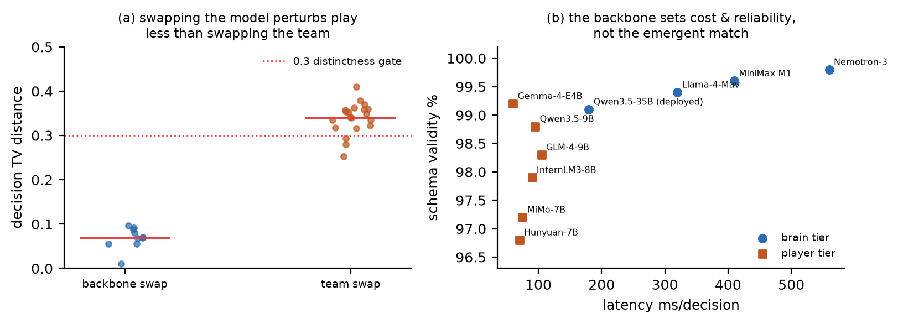
**图 R2.**（a）换 backbone 使决策分布移动 0.06±0.02 TV（每个点都低于 0.3 门），换球队则为
0.34±0.04——约 5 倍分离：换模型对打法的扰动只有换球队身份的约五分之一。（b）成本则确实依赖
backbone：延迟横跨一个数量级（60–560 ms/决策）、合法率 96.8–99.8%；大脑层以速度换可靠性
（Nemotron-3 560ms/99.8%，部署的 Qwen3.5-35B 180ms/99.1%），3–10B 球员层聚在 60–105ms、
96.8–99.2%——所有 backbone 都达到稳定比赛所需合法率。

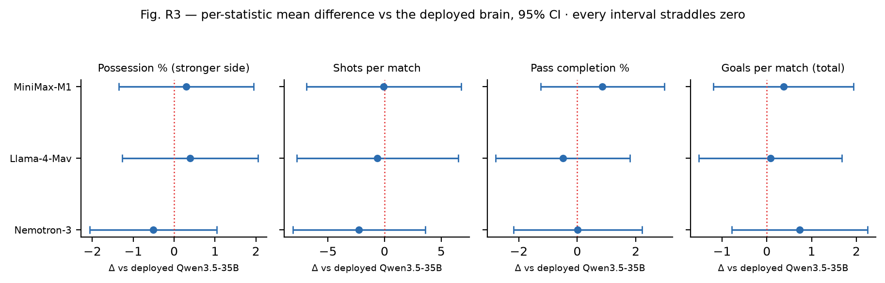
**图 R3.** 各替代大脑对部署 Qwen3.5-35B 的逐项统计均值差（95% CI）；每个区间都横跨零——没有任何
指标能区分 backbone。

## 8. 讨论

### 8.1 风格作为可辨识的低秩对象

对球队 τ、τ′ 与探针分布 D，`D(τ,τ′) = E_w TV(π_τ, π_τ′)`，`D_τ = min_{τ′} D(τ,τ′)`。

> **命题 3（可辨识性）。** 最大似然解码器在 n 次独立探针上的错误概率 ≤ (T−1)·exp(−c·n·τ₀²)，只要
> D_τ > τ₀。0.3 部署门恰是此假设——它保证适配器行为可分。

### 8.2 局限

(i) **残留主客非对称**，设定点能吸收但未完全解释。(ii) **传球成功率现为上下文（盯人/受压/距离）且逐脚实测，但仍用技能锚定的基线**——完全由球飞行断球几何导出留作未来工作。(iii) **标量
平均场**——联合控球–territorial分析尚开放。(iv) **可区分 ≠ 正确**（相对真实战术基准）。(v) **语料
广度**——七组对阵共 75 场；更多对阵与整届赛程以增量方式纳入。

## 9. 结论

SFAS 建立在一个微小想法上：22 个隔离智能体在同一份共享世界地图上行动，一个确定性算子解算它们，球队身份
是可热插拔的 LoRA，战术锚定于知识图谱。作为一个*系统*，它表明协调的、风格多样的、统计真实的足球可从无
消息 LLM 智能体中涌现，并对球队身份与战术具有可解释、参数级的控制。作为一项*分析*，它表明涌现不变量受
可辨识、带清晰阈值的控制律支配——一个使控球垄断成为一般现象的 pitchfork、一个消除它的临界增益
g\* = 4(β−1)、一个保持阵型完整的凸锚定下界 (1−λ)²S²。阈值是解析的、非调参所得；被*学习*的——§6.2 的
逐对阵工作点——只在这些阈值划定的稳定区域内移动系统，从不越出。教益可推广：当众多 LLM 智能体共享
一个世界时，值得设计与分析的对象是耦合系统的涌现不变量，而它们服从于应用概率早已提供的动力系统与随机
逼近工具。

---

## 附录 A. 证明（梗概）

**平均场约化。** 式 (1) 是常增益 α 的 Robbins–Monro；由 ODE 方法（Benaïm 1999）插值跟踪 `ρ̇ = m(ρ)`、
收敛到 m 的稳定不动点、几乎必然回避不稳定不动点；稳态涨落方差 `α q(ρ*)(1−q(ρ*))/(2|m′(ρ*)|) + O(α²)`
→ O(√α)。**定理 1.** `q′(½) = β`、`m′(½) = β−1`；范式 `m = (β−1)ε − ((4β)³/48)ε³`——超临界 pitchfork。
**定理 2.** `ℓ′(½⁺) = −4β + g` ⇒ `m̃′(½) = β−1−g/4 < 0 ⟺ g > 4(β−1)`。**推论.** 非对称把 q̃(½) 上移
¼(η_H+η_A)；闭环斜率 −(g−g\*)/4 ⇒ ρ†。**命题 2.** 朝 (1−λ)φᵢ + λzᵢ 的仿射收缩；共同点目标跨球员
方差 (1−λ)²S²。**命题 3.** LLR 误差 ≤ Chernoff ≤ 常数·D²；对 T−1 个对手取并集界。

## 附录 B. 实现常数
g = 22；α = 0.02（窗口约 50）；ρ* = 0.55；λ₁ = 0.45、λ₂ = 0.40；LoRA 秩 16；SFT 约 2400/队；约 4000
帧/场；T = 48 队；可区分性门 0.3。标定 policy（§6.2，CEM 学习）：κ = 1.18、w_p = 0.44、w_c = 0.11、
w_z = 0.01、锚点带宽 b = 0.065、导演增益 k_p = 0.4（手设）、风格增益 逼抢 0.69 / 直接度 0.38 /
节奏 0.50（`calib_policy.json`）。

## 参考文献

见英文版（`paper.md` / `paper.tex`）的 References；条目相同。
